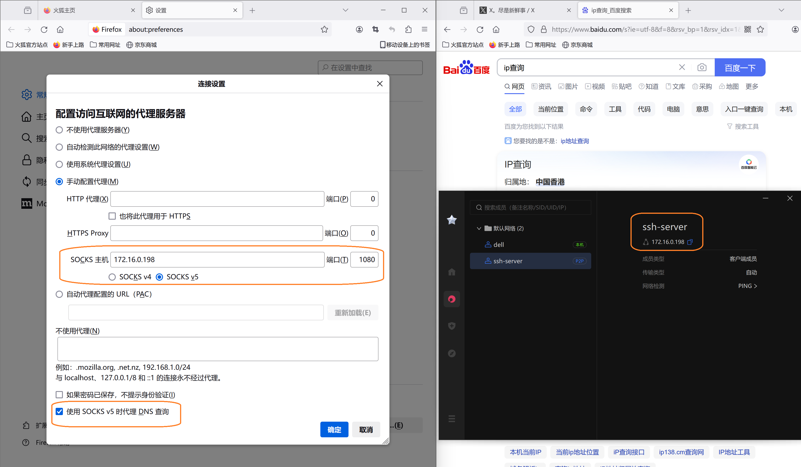

# 一、组网代理

这里介绍一种简易的上网外的方法：使用外网ubutu服务器Dante Server+蒲公英



## 1.1本地电脑安装蒲公英

- 客户端windows下载并安装：https://d.oray.com/pgy/windows/PgyVisitor_6.3.0_x64.exe
- 客户端windows登录贝锐账号，没有账号先创建账号，免费的可以组网三台设备，如果家里一台电脑，公司一台电脑，服务器一台电脑，这样免费的刚刚好。
- 客户端windows在蒲公英客户端软件中取得服务器蒲公英网络ip如：172.16.0.198

## 1.2外网服务器安装蒲公英

- 服务器linux命令行下载蒲公英：wget https://pgy.oray.com/softwares/153/download/2156/PgyVisitor_6.2.0_x86_64.deb
- 服务器linux命令行安装蒲公英：sudo dpkg -i PgyVisitor_6.2.0_x86_64.deb
- 服务器linux命令行登录之前注册的贝锐账号：pgyvisitor login

## 1.3除了蒲公英还可以用zerotier ubuntu下安装启动zerotier方法
```
curl -s https://install.zerotier.com | sudo bash #安装

sudo systemctl enable zerotier-one.service #设置自启动

sudo systemctl start zerotier-one.service#启动

sudo zerotier-cli join 41d49af6c252649d#加入网络
```
## 1.3外网服务器安装配置dante-server

- sudo apt install dante-server#服务器安装socksv5代理
- sudo nano /etc/danted.conf #修改配置,添加至末尾：内网网卡oray_vnc通过ifconfig查看出来的 外网网卡eth0

```
internal: oray_vnc port = 1080
external: eth0
method: username none
user.privileged: root
user.unprivileged: nobody
client pass {
    from: 0.0.0.0/0 to: 0.0.0.0/0
    log: error connect disconnect
}
socks pass {
    from: 0.0.0.0/0 to: 0.0.0.0/0
    log: error connect disconnect
}

```

- sudo systemctl start danted #启动danted服务
- sudo systemctl enable danted #开机自运行

## 1.4客户端windows全局代理上网

- 客户端windows编辑一个.reg后缀的文件,内容如下

```
Windows Registry Editor Version 5.00

[HKEY_CURRENT_USER\SOFTWARE\Microsoft\Windows\CurrentVersion\Internet Settings]

"ProxyServer"="socks://172.16.0.198:1080"
```

- 客户端windows左下角搜索框中搜索“代理”：进入网络和Internet>代理>手动代理点上“开”代理ip填入socks://172.16.0.198 端口填入1080
- 客户端windows双击运行reg文件注册表注入后即可使windows全局用本地socks://172.16.0.198:1080上网，如果服务器放在“外地”的话就可以用“外地”的网络了上网，腾讯，阿里，UCLOUD......都可以。

## 1.5客户端火狐浏览器代理上网

- 火狐浏览器设置中搜代理进入网络设置下面选手动代理SOCKS主机填入127.0.0.1 SOCKS v5选项 另外“使用SOCKSv5 时代理DNS查询” 这个要勾上。


## 1.6 ssh代理转发
```
ssh -N -D 192.168.1.123:1080 ubuntu@172.16.0.198
```
- 在能上网的电脑运行以上ssh端口转发指令
- 在不能上网的电脑使用`socks5://192.168.1.123:1080/`代理上网

## 1.7 ubuntu 全局代理
```
sudo nano /etc/environment   
all_proxy=socks5://192.168.1.123:1080/ #添加在/etc/environment 文件中
sudo systemctl restart networkd-dispatcher.service #重启网络
```
# 二、ubuntu下编译调试stm32

## 下载安装stm32cubeclt

- https://www.st.com/en/development-tools/stm32cubeclt.html     #下载
- sudo bash st-stm32cubeclt_1.15.0_20695_20240315_1429_amd64.sh #安装

## 下载openocd及其子模块后编译安装

- git clone https://gitee.com/x-itg/openocd.git # 从我的仓库克隆下openocd的源码；参考 https://blog.csdn.net/daoshengtianxia/article/details/115038674
- sudo apt-get install libncurses5 lsb-core build-essential pkg-config autoconf automake libtool libusb-dev libusb-1.0-0-dev libhidapi-dev libtool libsysfs-dev #编译openocd源码需要安装的软件
- sudo ./bootstrap
- sudo ./configure --enable-stlink
- sudo make
- sudo make install #安装在了/usr/local/bin 配置文件在 /usr/local/share/openocd/scripts
- sudo cp stm32f1discovery.cfg /usr/local/share/openocd/scripts/board

## VSCODE工程工作目录下makefile文件修改

```
upload: build/$(PROJECT).bin
    openocd -f board/stm32f1discovery.cfg -c "reset_config trst_only combined" -c "program build/$(PROJECT).elf verify reset exit"
ifeq ($(OS),Windows_NT)
debug-start:
    openocd -f openocd_win.cfg
reset:
    openocd -f openocd_win.cfg -c init -c halt -reset -c shutdown
else
debug-start:
    openocd -f openocd_lnx.cfg
reset:
    openocd -f openocd_lnx.cfg -c init -c halt -reset -c shu
```

## 在VSCODE工程工作目录下添加openocd.cfg文件，内容：

```
source [find /usr/local/share/openocd/scripts/interface/stlink.cfg]
source [find /usr/local/share/openocd/scripts/target/stm32f1x.cfg]### 
```

## .vscode 文件夹下面的 launch.json文件修改

```

.vscode文件夹下launch.json:
{
    // See https://go.microsoft.com/fwlink/?LinkId=733558
    // for the documentation about the tasks.json format
    "version": "0.2.0",
    "configurations": [
        {
            "name": "wsl-ubuntu1804-stm32f1-openocd", //调试入口显示的名字，随便起
            "cwd": "${workspaceRoot}", //工作目录，根路径
            "armToolchainPath": "/opt/st/stm32cubeclt/GNU-tools-for-STM32/bin/arm-none-eabi-gcc",
            "gdbPath": "/opt/st/stm32cubeclt/GNU-tools-for-STM32/bin/arm-none-eabi-gdb",
            "executable": "${workspaceFolder}/build/EC20103RB.elf", //调试文件
            "request": "launch",
            "type": "cortex-debug", //配置为使用插件调试
            "servertype": "openocd", //映射openocd
            "configFiles": [
                "${workspaceRoot}/openocd_lnx.cfg"
            ], //openocd配置
            "postDebugTask": "Reset", //同上，调试结束执行的任务

        },
        {
            // For the Cortex-Debug extension
            "name": "win-ST-Link",
            "type": "cortex-debug",
            "servertype": "openocd",
            "request": "launch",
            "executable": "${workspaceRoot}/build/EC20103RB.elf",
            "configFiles": [
                "C:/Program Files/OpenOCD/0.10.0-13/scripts/interface/stlink-v2.cfg",
                "C:/Program Files/OpenOCD/0.10.0-13/scripts/target/stm32f1x_stlink.cfg",
            ],
            "cwd": "${workspaceRoot}"
        }
    ]
}
```

# 三、windows下工程搭建stm32 vscode

自动把STM32编译调试需要的armgcc openocd以及环境变量安装到C:\Program Files (x86)\windowstool的工具：

https://github.com/x-itg/x-itg-notebook/releases/download/untagged-0529c8ebfcfb3dda44b4/OpenOCD_ArmGCC_MakeTool.msi

# 四、SSH自动登录

```
--------------ubuntu开启ssh----------------------------
1. 查看是否安装SSHServer：ps -e|grep ssh
2. 安装SSHServer：sudo apt-get install openssh-server
3. 修改sshd_config: sudo nano /etc/ssh/sshd_config
- port 22
- PermitRootLogin prohibit-password
- PermitRootLogin yes
4. 启动SSH：/etc/init.d/ssh start
5. 设置开机自启SSH：sudo systemctl enable ssh

生成密钥：
ssh-keygen -t rsa 
------------------------------
powershell下运行： 
function ssh-copy-id([string]$userAtMachine, $args){   
    $publicKey = "$ENV:USERPROFILE" + "/.ssh/id_rsa.pub"
    if (!(Test-Path "$publicKey")){
        Write-Error "ERROR: failed to open ID file '$publicKey': No such file"      
    }
    else {
        & cat "$publicKey" | ssh $args $userAtMachine "umask 077; test -d .ssh || mkdir .ssh ; cat >> .ssh/authorized_keys || exit 1"  
    }
}
-------------------------------
powershell下运行(上传公钥):
ssh-copy-id ubuntu@IP地址
-------------------------------
修改C:\Users\mason\.ssh\config
Host 001
 HostName 远程IP地址
 User ubuntu
 IdentityFile C:/Users/mason/.ssh/id_rsa
-------------------------------
登录
ssh 001
```

# 五、远程ubuntu用本地windows的usb

本地windows电脑使用usbipd-win做usbip的服务器
远程ubuntu使用usbip做usbip的客户端
利用ssh将远程ubuntu的3240端口转发到本地主机的3240端口
参考：
[云服务器 Linux 系统使用 USB/IP 远程共享 USB 设备-最佳实践-文档中心-腾讯云](https://cloud.tencent.com/document/product/213/43016)
[安装usbipd-win](https://github.com/dorssel/usbipd-win)

## 本地USB服务器含有物理USB,：

```
usbipd list （本地windows安装usbipd-win后powershell里运行查看usb）
usbipd bind --force -b 2-1（把本地usb分享出去）
ssh -Nf -R 3240:localhost:3240 ubuntu@XXX.XXX.XXX.XXX （创建SSH隧道）
```

## 远程USB客户端物理USB：

```
sudo modprobe usbip-core
sudo modprobe usbip-host
sudo modprobe usbip-vudc  # 服务端非必须
sudo modprobe vhci-hcd #必须attach失败就再试这条
sudo modprobe usbip-host
sudo usbip list --remote 127.0.0.1(远程查看端口有没有打通)
sudo usbip attach -r 127.0.0.1 -b 2-1 （载入与detach命令对应相反）usbip attach --remote=127.0.0.1 --busid=2-2
sudo lsusb（查看已经对接上的USB）# sudo mknod /dev/ttyUSB0 c 1A86 7523
dmesg | grep tty
sudo minicom -s #设置下波特率 就可以收发com数据了 
ps aux | grep minicom
sudo kill PID
```

# 六、WSL

- wsl --update # windows 终端下运行

## 清华源

- sudo nano /etc/apt/sources.list

```
# 默认注释了源码镜像以提高 apt update 速度，如有需要可自行取消注释
deb https://mirrors.tuna.tsinghua.edu.cn/ubuntu/ jammy main restricted universe multiverse
# deb-src https://mirrors.tuna.tsinghua.edu.cn/ubuntu/ jammy main restricted universe multiverse
deb https://mirrors.tuna.tsinghua.edu.cn/ubuntu/ jammy-updates main restricted universe multiverse
# deb-src https://mirrors.tuna.tsinghua.edu.cn/ubuntu/ jammy-updates main restricted universe multiverse
deb https://mirrors.tuna.tsinghua.edu.cn/ubuntu/ jammy-backports main restricted universe multiverse
# deb-src https://mirrors.tuna.tsinghua.edu.cn/ubuntu/ jammy-backports main restricted universe multiverse

deb http://security.ubuntu.com/ubuntu/ jammy-security main restricted universe multiverse
# deb-src http://security.ubuntu.com/ubuntu/ jammy-security main restricted universe multiverse

# 预发布软件源，不建议启用
# deb https://mirrors.tuna.tsinghua.edu.cn/ubuntu/ jammy-proposed main restricted universe multiverse
# # deb-src https://mirrors.tuna.tsinghua.edu.cn/ubuntu/ jammy-proposed main restricted universe multiverse
```

## wsl 安装应用

- sudo apt update
- sudo apt upgrade
- sudo apt install gnome-text-editor -y
- sudo apt install gimp -y
- sudo apt install nautilus -y
- sudo apt install vlc -y
- sudo apt install x11-apps -y
- wget https://dl.google.com/linux/direct/google-chrome-stable_current_amd64.deb
- sudo apt install --fix-missing ./google-chrome-stable_current_amd64.deb

## wsl ubuntu 安装 wps后提示字体缺失

- git clone https://github.com/jiaxiaochu/font.git && cd font && ./install.sh

## wsl ubuntu 安装中文输入法 安装wps

- sudo apt install language-pack-zh-hans
- sudo dpkg-reconfigure locales #这一步要选择en_US.UTF-8和zh_CN.UTF-8, 并且zh_CN.UTF-8为默认语言
- sudo apt install fontconfig
- 创建/etc/fonts/local.conf

```
<?xml version="1.0"?>
<!DOCTYPE fontconfig SYSTEM "fonts.dtd">
<fontconfig>
    <dir>/mnt/c/Windows/Fonts</dir>
</fontconfig>
```

- fc-cache -f -v #刷新字体
- wsl --shutdown #命令行关闭wsl ubuntu
- sudo apt install fcitx dbus-x11 im-config fcitx-sunpinyin #重新进入wsl ubuntu
- 编辑/etc/locale.gen文件

```
# 找到 # zh_CN.UTF-8 这一行，取消注释
zh_CN.UTF-8
```

- 编辑~/.profile文件

```
export GTK_IM_MODULE=fcitx
export QT_IM_MODULE=fcitx
export XMODIFIERS=@im=fcitx
export DefaultIMModule=fcitx
fcitx-autostart &>/dev/null
```

- source ~/.profile #刷新
- 下载 https://www.wps.cn/product/wpslinux/wps-office_11.1.0.11719_amd64.deb
- sudo dpkg -i wps-office_11.1.0.11719_amd64.deb

## WSL UBUNTU使用WINDOWS的USB口

参考：
[连接 USB 设备 | Microsoft Learn](https://learn.microsoft.com/zh-cn/windows/wsl/connect-usb)
[安装usbipd-win：](https://github.com/dorssel/usbipd-win)

```
wsl ubuntu:
sudo apt install linux-tools-generic hwdata(ubunutu下安装)
sudo update-alternatives --install /usr/local/bin/usbip usbip /usr/lib/linux-tools/*-generic/usbip 20
---------------------------------
windows powershell:
usbipd wsl list
usbipd wsl attach --busid 2-1(powershell下连接usb连到wsl：)
usbipd wsl detach --busid 2-1(powershell下连接usb断开wsl：)
---------------------------------
wsl ubuntu:
lsusb
----------------------------------
将wsl端口共享到局域网，端口转发：
wsl ubuntu 
ip addr show eth0
windows powershell：
netsh interface portproxy add v4tov4 listenport=3390 listenaddress=0.0.0.0 connectport=3390 connectaddress=192.168.92.156 protocol=tcp
netsh interface portproxy add v4tov4 listenport=2222 listenaddress=0.0.0.0 connectport=2222 connectaddress=192.168.92.156
netsh interface portproxy add v4tov4 listenport=22 listenaddress=0.0.0.0 connectport=22 connectaddress=192.168.92.156
netsh interface portproxy show all
netsh interface portproxy reset #删除所有端口转发
```

# 七、ROS、Python

把pip的安装源设置为国内的清华源

pip config set global.index-url https://pypi.tuna.tsinghua.edu.cn/simple/

## 8.1 WSL2 下 ROS 添加ROS官方源添加密钥

[(14条消息) win10 wsl2 + ubuntu20.04 配置 ROS-Noetic_lainegates的博客-CSDN博客_wsl2 rosnoetic](https://blog.csdn.net/LaineGates/article/details/120910628)

```
sudo sh -c 'echo "deb http://packages.ros.org/ros/ubuntu $(lsb_release -sc) main" > /etc/apt/sources.list.d/ros-latest.list'
sudo apt-key adv --keyserver 'hkp://keyserver.ubuntu.com:80' --recv-key C1CF6E31E6BADE8868B172B4F42ED6FBAB17C654
echo "source /opt/ros/noetic/setup.bash" >> ~/.bashrc
source ~/.bashrc
```

## 8.2 安装配套工具初始化rosdep开机自动进行ROS环境配置

```
sudo apt install python3-rosdep python3-rosinstall python3-rosinstall-generator python3-wstool build-essential
sudo apt-get install python3-pip
sudo pip install rosdepc
sudo apt-get install python3-roslaunch
sudo apt-get install ros-noetic-roslaunch
sudo rosdepc init
rosdepc update
sudo apt install python3-rosnode #安装节点查看工具rosnode list #查看节点
sudo apt-get install ros-noetic-rqt #rqt_graph
sudo apt-get install ros-noetic-rqt-common-plugins #rqt_graph
sudo apt-get install ros-noetic-rqt ros-noetic-rqt-common-plugins ros-noetic-turtlesim
source /opt/ros/noetic/setup.bash
```

- 安装ros-tutorials程序包
- 软件包查找如
- 软件包定位如

```
sudo apt-get install ros-noetic-ros-tutorials
rospack find roscpp
roscd roscpp
roscd roscpp/cmake
```

- 创建软件包 快速开始

```
my_package/
  CMakeLists.txt#配置Catkin元包的CMakeLists.txt模板文件
  package.xml#提供软件包元信息

mkdir -p ~/catkin_ws/src
cd ~/catkin_ws/src
git clone https://gitee.com/ros1-learning/beginner_tutorials.git
cd ~/catkin_ws/
catkin_make
roscore
rosrun beginner_tutorials listener
rosrun beginner_tutorials talker
```

## 8.3 创建Catkin工作空间

```
cd ~/catkin_ws/
catkin_make #构建一个catkin工作区并生效配置文件
source devel/setup.bash
cd ~/catkin_ws/src
catkin_create_pkg beginner_tutorials std_msgs rospy roscpp #在catkin_ws/src创建软件包
rospack depends1 beginner_tutorials #查看包依赖
roscore #开启核心节点
rosrun turtlesim turtlesim_node #启动小乌龟节点
rosrun turtlesim turtle_teleop_key #开启小乌龟遥控节点
rosrun rqt_graph rqt_graph #打开画图图形
rosmsg show geometry_msgs/Twist #查看消息类型的详细信息

rostopic echo /turtle1/cmd_vel ##### 显示话题内容
rostopic type /turtle1/cmd_vel ##### 查看话题消息类型
rostopic pub -1 /turtle1/cmd_vel geometry_msgs/Twist -- '[2.0, 0.0, 0.0]' '[0.0, 0.0, 1.8]'##### 发布消息
rostopic pub /turtle1/cmd_vel geometry_msgs/Twist -r 1 -- '[2.0, 0.0, 0.0]' '[0.0, 0.0, -1.8]'##### 1Hz频率发送话题消息

rosrun rqt_plot rqt_plot # rqt_plot命令可以在滚动时间图上显示发布到某个话题上的数据。这里我们将使用rqt_plot命令来绘制正被发布到/
rosrun rqt_console rqt_console #连接到了ROS的日志框架
rosrun rqt_logger_level rqt_logger_level #节点运行时改变输出信息的详细级别

rosservice list #服务
rosservice call /clear #调用/call服务

rosparam list #参数服务器
rosparam set /turtlesim/background_r 150
rosparam get /turtlesim/background_r 
rosservice call /clear
rosparam get / #获取参数服务器上所有内容
--------------------------------------------------------------
mkdir msg
echo "int64 num" > msg/Num.msg
msg package.xml 加入依赖项：
<build_depend>message_generation</build_depend>
<exec_depend>message_runtime</exec_depend>

msg CMakeLists.txt find_package中加入message_generation
# 不要直接复制这一大段，只需将message_generation加在括号闭合前即可
find_package(catkin REQUIRED COMPONENTS
   roscpp
   rospy
   std_msgs
   message_generation #加入这个
)
#添加编译
add_message_files(
  FILES
  Num.msg
)
#查看消息是否在ROS中起作用了
rosmsg show beginner_tutorials/Num

-------------------------------------------------------------
roscd beginner_tutorials
mkdir srv
roscp rospy_tutorials AddTwoInts.srv srv/AddTwoInts.srv
#package.xml中确保开启message创建和message运行依赖
<build_depend>message_generation</build_depend
msg CMakeLists.txt find_package中加入message_generation
# 不要直接复制这一大段，只需将message_generation加在括号闭合前即可
find_package(catkin REQUIRED COMPONENTS
   roscpp
   rospy
   std_msgs
   message_generation #加入这个
)
#添加编译
add_service_files(
  FILES
  AddTwoInts.srv
)
generate_messages(
  DEPENDENCIES
  std_msgs
)
#查看服务
rossrv show beginner_tutorials/AddTwoInts
```
